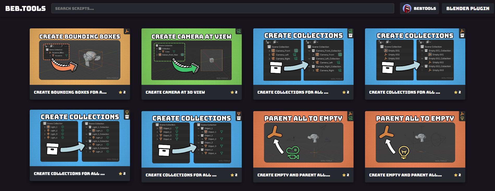

---
layout:
  title:
    visible: true
  description:
    visible: true
  tableOfContents:
    visible: true
  outline:
    visible: true
  pagination:
    visible: true
---

# 👋 Welcome to Beb.Tools

## What is Beb.Tools?

Hi, welcome to the docs. [Beb.Tools](https://beb.tools) is a Website and a Blender Plugin combo. The website is a community driven Script sharing platform and the Blender Plugin is a Script Manager. Think of the Blender Plugin like a swiss army knife that lets you add and manage custom tools without needing to be a computer wizard while the Website is a Customs Tools Marketplace but everything is open-source and free 😊

<figure><figcaption></figcaption></figure>

## Want to jump right in?


[getting-started.md](getting-started.md)


## Website Features



* Create, share, and download community made scripts directly into the [Beb.Tools](https://beb.tools) Blender Plugin for future use.

<figure><figcaption></figcaption></figure>



* Everything is open-source to support a UGC environment.

<figure><figcaption></figcaption></figure>



## Add-on Features



* Full Folder Management System including creating, renaming, moving, and deleting folders and scripts from the UI.

<figure><figcaption></figcaption></figure>



* Scripts that include ReadMe's will display in the plugin.

<figure><figcaption></figcaption></figure>



* Full Queue Management System, run multiple scripts one after another, in the order you specify. Save your queues for future uses. Modify them at any time. Share them if you want.

<figure><figcaption></figcaption></figure>


