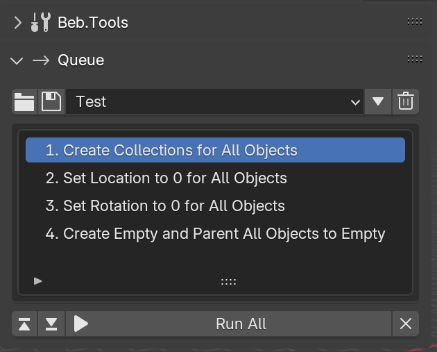

# 🎮 Queue Buttons

<figure><figcaption></figcaption></figure>

## Queue Panel: Buttons

<figure><figcaption></figcaption></figure>

 Import Queue from Folder

Imported a previously saved list of scripts to run!

 Save Queue

Saves the contents of the Queue to a .txt file within the Blender Addon.\
\
Useful for future sessions.

Dropdown Selector

View your previously saved queues and pick one to load!

 Push Selected Queue

Loads the list of scripts from the Queue you picked in the dropdown into the Queue System.

 Delete

Throws away a previously saved Queue you no longer need!\
\
This actually deletes the file. Be careful.

 Move Selected Script Up

Moves the selected script higher in your run list!

 Move Selected Script Down

Moves the selected script lower in your run list!

 Run All

Runs all scripts in your Queue Systems list, one by one, in order.

 Clear Queue

Wipes the Queue System clean to start again.\
\
This is safe, this is not a delete features, its a clear list feature.

