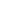

# 🗃️ Queue System

<figure><figcaption></figcaption></figure>

## Selecting a Queue

<figure><figcaption></figcaption></figure>

 Run Selected

Runs only the selected script in the Queue System.

 Run All

Runs all scripts in your Queue Systems list, one by one, in order.

 Remove

Removes the selected script from the Queue System.

 Clear

Wipes the Queue System clean to start again.\
\
This is safe, this is not a delete features, its a clear list feature.

