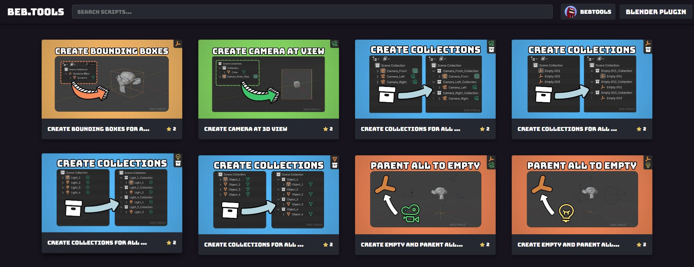
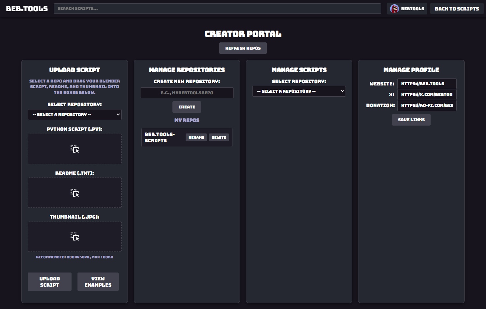
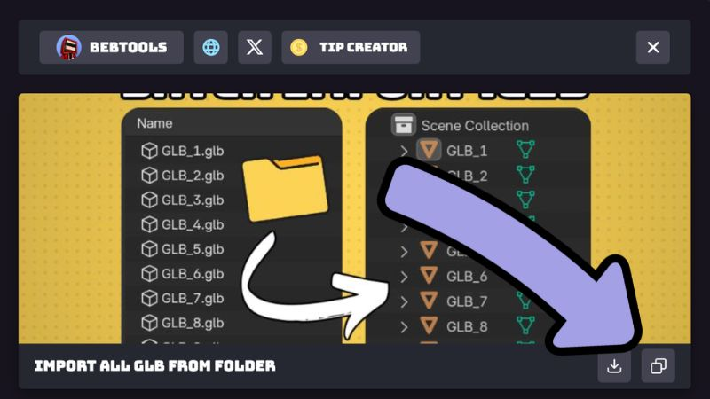
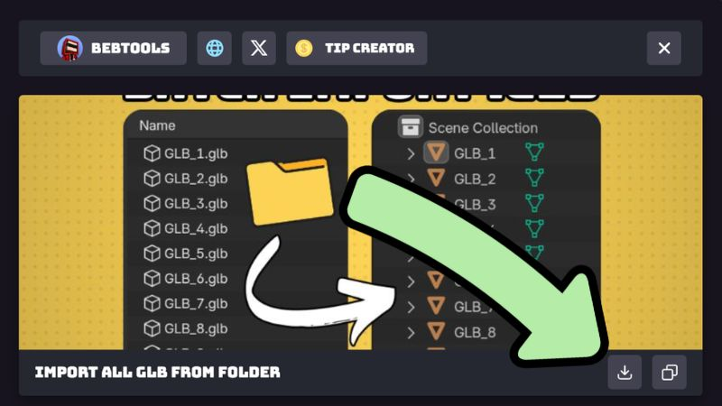

# 🗒️ Getting Scripts

## How to Download Scripts from Beb.Tools

<figure><figcaption></figcaption></figure>

## 1. Select a Script

<figure><figcaption></figcaption></figure>

## 2. A Pop Up Window Will Appear

<figure><figcaption></figcaption></figure>

## 3a. Click on the Copy Button on the Beb.Tools Website

<figure><figcaption></figcaption></figure>

## 4a. Click on the Paste Button in the Beb.Tools Plugin

<figure><figcaption></figcaption></figure>

## 3b. Alternative: Click on the Download Button

<figure><figcaption></figcaption></figure>

## 4b. Click on the Folder Button in the Beb.Tools Plugin to import

<figure><figcaption></figcaption></figure>
