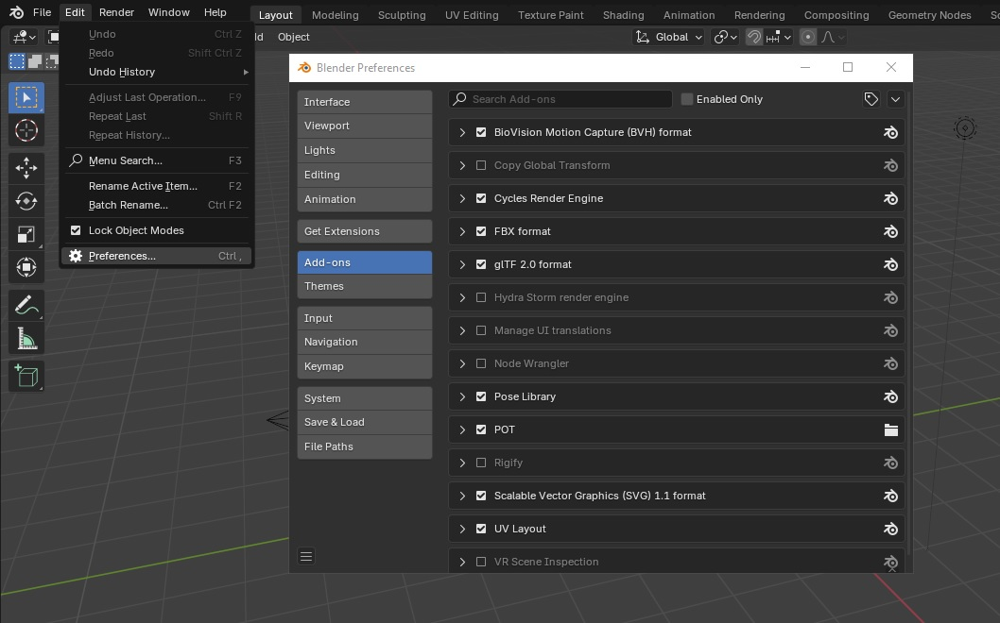
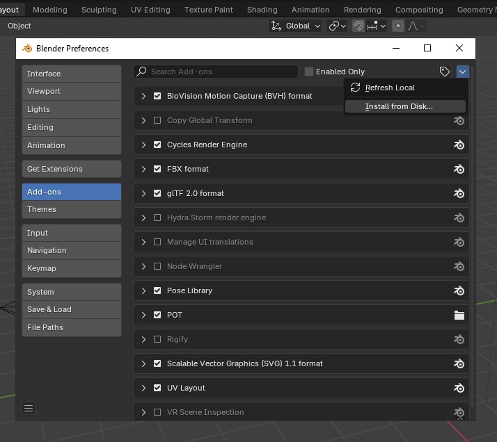
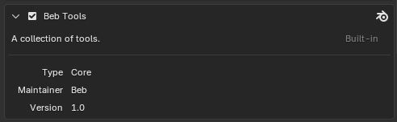
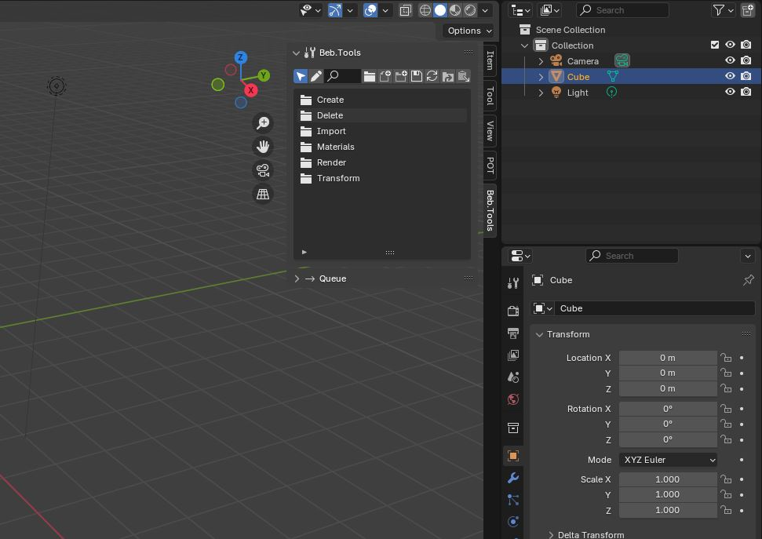

# ❓ How to add Beb.Tools to Blender

## Let’s get Beb.Tools into your Blender!

<figure><figcaption></figcaption></figure>

## What You’ll Need

* [Blender 4.2](http://blender.org/download/releases/4-2/)
* BebTools.zip (Blender Plugin)

## Step-by-Step

1. **Open Blender**:
   * Start Blender 4.2 on your computer.
2. **Find the Add-ons Menu**:
   * Click `Edit` at the top (it’s near `File`).
   * Choose `Preferences` from the list.
   * A new window pops up. Click `Add-ons` on the left side.

<figure><figcaption></figcaption></figure>

3. **Add Beb Tools**:
   * Click the "Down Arrowhead" button near the top.
   * Select `Install from Disk`
   * A file picker opens. Find your `BebTools.zip` file (do not unzip).
   * Click `Install from Disk`.

<figure><figcaption></figcaption></figure>

4. **Turn It On**:
   * Look for “Beb Tools” in the list (type “Beb” in the search bar if it’s hard to find).
   * Check the little box next to it to turn it on.

<figure><figcaption></figcaption></figure>

5. **Check if it worked**:
   * Close the Preferences window.
   * In the 3D View (where the cube is), press the `N` key on your keyboard.
   * A sidebar slides out—look for a tab called “Beb.Tools”. You did it!

<figure><figcaption></figcaption></figure>
